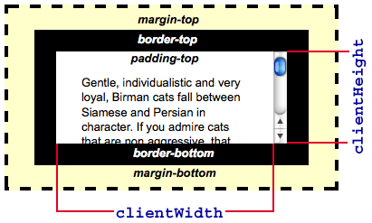

The browser has two coordinate systems:
  1. relative to the **document**: zero point is at the top-left corner of the document.
  2. relative to the **window**: zero point is at the top-left corner of the viewport (visible area).


#### Coordinate System useful methods


**element.getBoundingClientRect():**
Returns the size of an element and its position relative to the viewport.

eg.: To get the position of an element inside the document (document !== viewport)
```javascript
elm.getBoundingClientRect().top + window.pageYOffset
elm.getBoundingClientRect().left + window.pageXOffset
```

**document.elementFromPoint(x, y):**
Returns an array of all elements at the specific coordinate.


**element.clientHeight/clientWidth:** read-only property is zero for elements with no CSS or inline layout boxes, otherwise it's the inner height/width of an element in pixels, including padding but *not the horizontal scrollbar height, border, or margin*.
  Note: This property will round the value to an integer. If you need a fractional value, use element.getBoundingClientRect().

  

**element.offsetHeight/offsetWidth:** read-only property is the height/width of the element *including vertical padding and borders, as an integer*.


**element.scrollTop/scrollLeft:** gets and sets the number of pixels that the content of an element is scrolled.

**element.scrollWidth/scrollHeight:** read-only property that returns either the width on pixels of the content of an element or the width of the element itself, whichever is greater.
